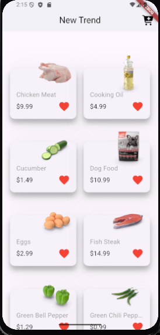
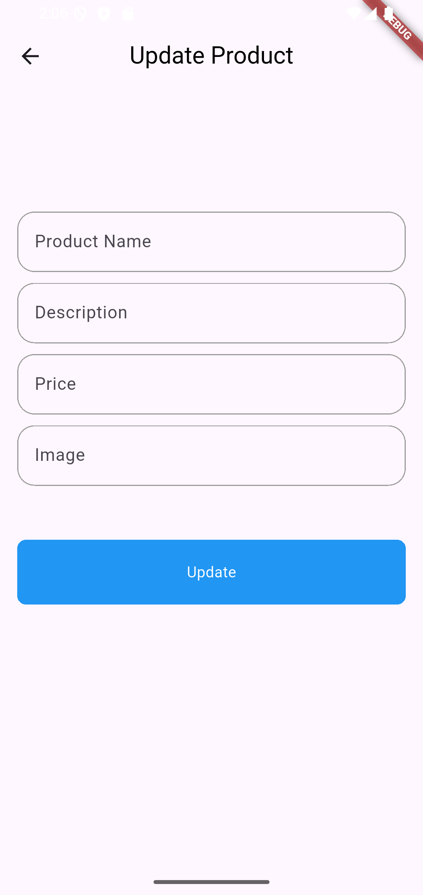

# 🛍️ Store App

A Flutter e-commerce application with a clear separation between UI, models, API services, and reusable components.

The application consumes the **DummyJSON Products API** to power product browsing and demonstrates practical REST API integration in a shopping workflow.

## ✨ Features
- 🛍️ Product listing from a REST API
- 📦 Product models and JSON parsing
- 🗂️ Product categories
- 🔎 Category-based product requests
- ➕ Add product through the API
- ✏️ Update product data
- ⏳ Loading states during asynchronous operations
- ⚠️ Error handling with `async/await` and `try/catch`
- 🧩 Reusable product cards and form components
- 📱 Product grid UI

## 🌐 API Integration
The app demonstrates:
- **GET** requests for products and categories
- **Path parameters**
- **Query parameters**
- **POST** requests for adding products
- **PUT** requests for updating products
- Request bodies and response parsing
- HTTP status-code handling
- Optional Bearer authorization in the API helper

## 🏗️ Code Organization
```text
lib/
├── helper/
│   └── api.dart
├── models/
│   └── product_model.dart
├── services/
│   ├── all_product_services.dart
│   ├── all_categories_service.dart
│   ├── categories_service.dart
│   ├── add_product.dart
│   └── update_product_service.dart
├── views/
│   ├── home_view.dart
│   └── update_product_view.dart
├── widgets/
│   ├── custom_card.dart
│   ├── custom_button.dart
│   └── custom_text_field.dart
└── main.dart
```

## 🔄 API Flow
```text
UI
 ↓
Service
 ↓
API Helper
 ↓
HTTP Request
 ↓
DummyJSON
 ↓
JSON Response
 ↓
Model
 ↓
UI
```

## 🛠️ Tech Stack
- **Flutter & Dart**
- **HTTP**
- **DummyJSON Products API**
- **Modal Progress HUD NSN**
- **Font Awesome Flutter**

## 🚀 Getting Started
```bash
git clone https://github.com/Aahmedkamell/store_app.git
cd store_app
flutter pub get
flutter run
```

## ## 📱 Screenshots

### Products



### Update Product



```

## 🎯 Technical Highlights
- REST API integration
- Service/helper separation
- JSON-to-model conversion
- Async loading and error handling
- Product creation and update workflows
- Named-route navigation with model arguments

## 👨‍💻 Author
**Ahmed Ashraf Mohammed Kamel**  
Flutter Developer
